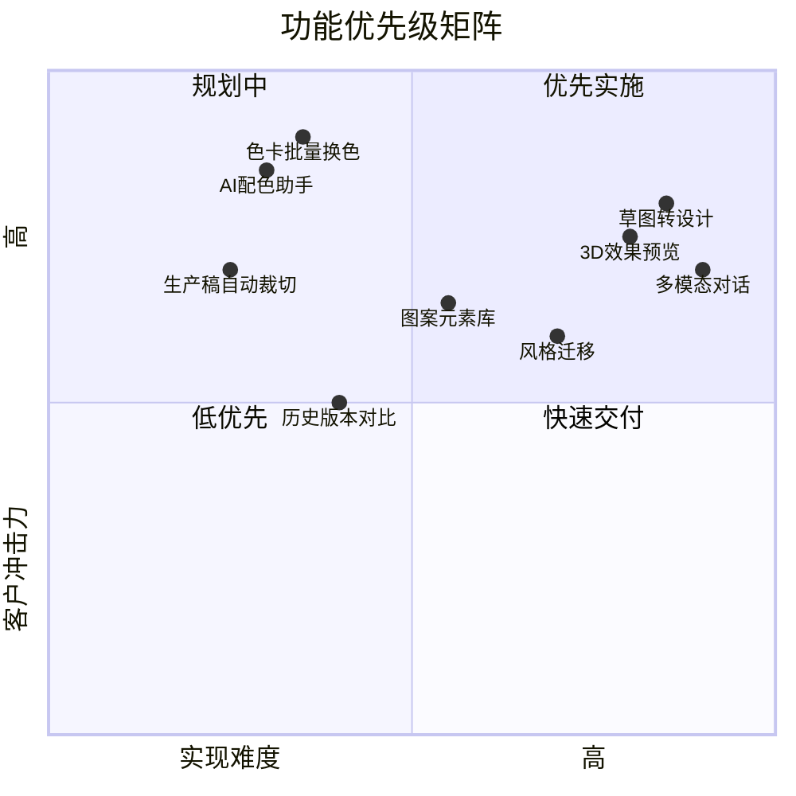
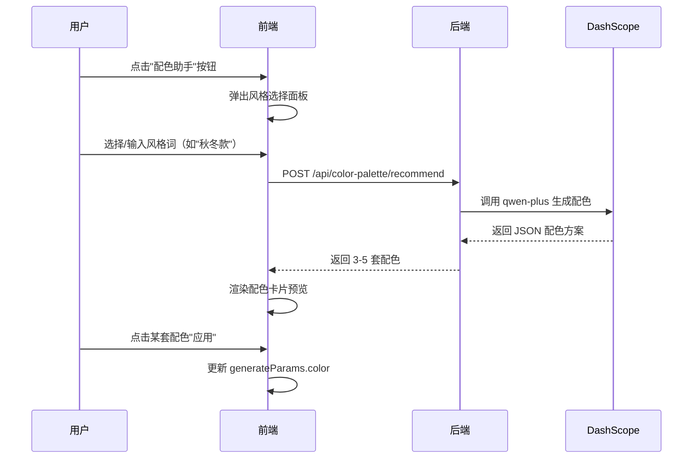

# Picture-AI 地毯图像生成系统 — 竞品分析与差异化建议

## 项目概述

Picture-AI 是一个专注于**地毯图像生成**的垂直领域解决方案，为地毯制造/设计行业提供定制化的 AI 生图能力。

---

## 一、当前核心功能分析（排除通用功能后）

> 以下功能**不考虑**文生图、图生图、搜图等通用能力（几乎所有生图工具都有），专注分析差异化价值点。

### ✅ 已实现的差异化功能

| 功能模块 | 说明 | 技术实现 |
|---------|------|---------|
| **垂直领域优化** | 专为地毯场景定制，所有提示词、参数均围绕地毯设计 | `generate.py` 中的 `_wrap_flat_design_production_prompt()` |
| **平面设计稿质检 (QC)** | 使用 VL 大模型检测生成稿是否满足生产标准 | `vision_service.py` 中的 `qc_flat_production_with_scores()` |
| **自然语言编辑指令** | "改成蓝色"、"变亮"等中文指令自动解析 | `prompt_translator.py` 的规则引擎 |
| **Session 化编辑流程** | 上传→分割→选区→编辑的完整交互链 | `interactive.py` 的 upload/pick/edit API |
| **智能提示词扩写** | 对简短输入进行语义通顺化，但严禁注入新参数 | `vision_service.py` 的受限扩写策略 |

### ⚠️ 分层编辑（初步实现）

当前 `flat_segmenter.py` 实现了基于**距离变换 (Distance Transform)** 的地毯分层：

- **rug_mask** — 地毯整体轮廓
- **border_mask** — 边框区域（距离 ≤ α × max_dist）
- **field_mask** — 内芯区域（距离 > α × max_dist）
- **background_mask** — 背景

**局限性**：
1. 只支持平面设计稿（白底/透明底），不支持实拍图
2. 分层颗粒度固定（border/field），无法处理多层图案
3. 没有语义分割能力（无法识别"花朵"、"几何图案"等具象对象）

---

## 二、与市面生图工具的对比

| 能力维度 | 市面通用工具 (Midjourney/SD/DALL-E) | Picture-AI |
|---------|-----------------------------------|------------|
| **领域专注度** | 通用，需用户自写专业 prompt | ✅ 地毯专用，内置行业术语和模板 |
| **生产稿合规性** | 无，需人工审核 | ✅ 自动 QC（满铺度/透视/阴影检测） |
| **参数化调色** | 需重新生成或手动 PS | ✅ 点击选区 + 自然语言换色 |
| **批量一致性** | 依赖 seed，效果不稳定 | 🔜 可扩展为色卡批量换色 |
| **行业 know-how** | 无 | ✅ 提示词受限扩写，避免生成不符合生产的图案 |

### 核心差异化优势

> [!IMPORTANT]
> **垂直场景 + 生产导向 + 闭环编辑** 是 Picture-AI 与通用生图工具的根本区别。

1. **"设计到生产"一站式** — 生成后可直接导出生产稿，无需二次加工
2. **质检自动化** — 减少人工审图成本
3. **非破坏性局部编辑** — 换色/调亮只影响选区，保留其他区域

---

## 三、下一步功能建议 — 让客户耳目一新

以下按**冲击力 × 可行性**排序，推荐优先实现前 3 项：

### 🚀 Tier 1：高冲击力 + 可快速交付

| # | 功能名称 | 描述 | 为什么让人耳目一新 |
|---|---------|------|------------------|
| 1 | **AI 配色助手** | 输入"秋冬款"或"北欧风"，自动推荐 3-5 套配色方案并一键应用 | 直击设计师痛点，省去挑色时间 |
| 2 | **色卡批量换色** | 上传一张设计稿 + 一组 Pantone/RAL 色号，自动生成全套色系变体 | 传统 PS 操作需数小时，AI 秒出 |
| 3 | **生产稿自动裁切** | 根据目标尺寸（如 1.6m × 2.3m）智能等比缩放 + 满铺裁切 | 一键适配不同打样规格 |

### 🌟 Tier 2：中高冲击力 + 需一定研发

| # | 功能名称 | 描述 | 为什么让人耳目一新 |
|---|---------|------|------------------|
| 4 | **图案元素库** | 预置花纹/边框矢量元素，用户可拖拽组合后再 AI 补全 | 半自动设计，降低创意门槛 |
| 5 | **历史版本对比** | 左右分屏展示编辑前后差异，支持滑动条切换 | 增强决策信心，常见于专业设计软件 |
| 6 | **3D 效果预览** | 将平面稿贴到 3D 房间场景中预览实际铺设效果 | WOW 级展示，提升客户信任感 |

### 🔮 Tier 3：长期创新方向

| # | 功能名称 | 描述 | 为什么让人耳目一新 |
|---|---------|------|------------------|
| 7 | **草图转设计** | 用户手绘草稿（iPad/纸质扫描）→ AI 自动生成完整地毯设计 | 打通"灵感→成品"全流程 |
| 8 | **风格迁移** | 上传一张喜欢的家居图片，提取风格应用到新地毯设计 | 让非专业客户也能精准表达需求 |
| 9 | **多模态对话** | "把主花放大 20%"、"边框加粗一点" 等自然语言精细控制 | 语音/文字即指令，所见即所得 |

---

## 四、建议优先级排序



---

## 五、总结

### 当前优势
1. **垂直深度** — 专为地毯行业定制，而非通用工具的"万金油"
2. **生产闭环** — QC 质检 + 平面稿标准 = 设计可直接投产
3. **交互创新** — 点击选区 + 自然语言编辑，门槛低于传统 PS

### 短期突破
- **AI 配色助手** + **色卡批量换色** 可在 1-2 周内交付，形成明显差异化卖点

### 长期护城河
- 持续积累地毯行业 know-how（花型、工艺、色彩趋势）
- 构建图案元素库和风格模板，形成数据资产

---

> [!TIP]
> 以下为 AI 配色助手的详细技术方案。

---

## 六、AI 配色助手技术方案

### 1. 功能概述

用户输入风格关键词（如"秋冬款"、"北欧风"），系统自动推荐 3-5 套配色方案，用户可一键应用到当前设计。



### 2. 后端 API 设计

#### 新增文件：`back/app/api/color_palette.py`

```python
from fastapi import APIRouter
from pydantic import BaseModel
from dashscope import Generation
from app.config.settings import settings

router = APIRouter()

class PaletteRequest(BaseModel):
    style_keyword: str  # 如 "秋冬款"、"北欧风"
    count: int = 5      # 返回配色方案数量

class ColorScheme(BaseModel):
    name: str           # 方案名称，如 "暖阳驼色系"
    primary: str        # 主色 HEX
    secondary: str      # 辅色 HEX
    accent: str         # 点缀色 HEX
    description: str    # 一句话说明

class PaletteResponse(BaseModel):
    schemes: list[ColorScheme]

@router.post("/color-palette/recommend", response_model=PaletteResponse)
async def recommend_palette(req: PaletteRequest) -> PaletteResponse:
    prompt = f"""你是地毯配色专家。请为"{req.style_keyword}"风格的地毯推荐 {req.count} 套配色方案。

每套方案包含：
- name: 方案名称（4-6字）
- primary: 主色 HEX（如 #8B4513）
- secondary: 辅色 HEX
- accent: 点缀色 HEX
- description: 一句话说明配色思路

仅输出 JSON 数组，不要其他文字：
[{{"name":"...","primary":"#...","secondary":"#...","accent":"#...","description":"..."}}]"""

    response = Generation.call(
        api_key=settings.API_KEY,
        model="qwen-plus",
        messages=[{"role": "user", "content": prompt}],
        result_format="message",
    )

    # 解析 JSON（需添加容错）
    import json
    raw = response.output.choices[0].message.content
    schemes = json.loads(raw)
    return PaletteResponse(schemes=[ColorScheme(**s) for s in schemes])
```

### 3. 前端组件设计

#### 新增文件：`web/src/components/shared/ColorPalettePanel.tsx`

```tsx
interface ColorScheme {
  name: string;
  primary: string;
  secondary: string;
  accent: string;
  description: string;
}

interface Props {
  onApply: (color: string) => void;
  onClose: () => void;
}

export const ColorPalettePanel: React.FC<Props> = ({ onApply, onClose }) => {
  const [keyword, setKeyword] = useState('');
  const [schemes, setSchemes] = useState<ColorScheme[]>([]);
  const [loading, setLoading] = useState(false);

  const handleRecommend = async () => {
    setLoading(true);
    const res = await fetch('/api/color-palette/recommend', {
      method: 'POST',
      headers: { 'Content-Type': 'application/json' },
      body: JSON.stringify({ style_keyword: keyword, count: 5 }),
    });
    const data = await res.json();
    setSchemes(data.schemes);
    setLoading(false);
  };

  return (
    <div className="palette-panel">
      <input value={keyword} onChange={(e) => setKeyword(e.target.value)} placeholder="输入风格词，如 秋冬款" />
      <button onClick={handleRecommend} disabled={loading}>
        {loading ? '推荐中...' : '获取配色'}
      </button>
      <div className="scheme-grid">
        {schemes.map((s, i) => (
          <div key={i} className="scheme-card" onClick={() => onApply(s.primary)}>
            <div className="color-strip">
              <span style={{ background: s.primary }} />
              <span style={{ background: s.secondary }} />
              <span style={{ background: s.accent }} />
            </div>
            <div className="scheme-name">{s.name}</div>
            <div className="scheme-desc">{s.description}</div>
          </div>
        ))}
      </div>
    </div>
  );
};
```

### 4. 集成到主逻辑

在 `InputArea.tsx` 中添加配色助手入口按钮，点击后弹出 `ColorPalettePanel`，用户选择配色后更新 `generateParams.color`。

---

## 七、后续功能方案（待展开）

- **色卡批量换色**：上传色号列表 → 循环调用分层换色 API → 打包下载
- **生产稿自动裁切**：输入目标尺寸 → 计算缩放比例 → 智能满铺裁切
